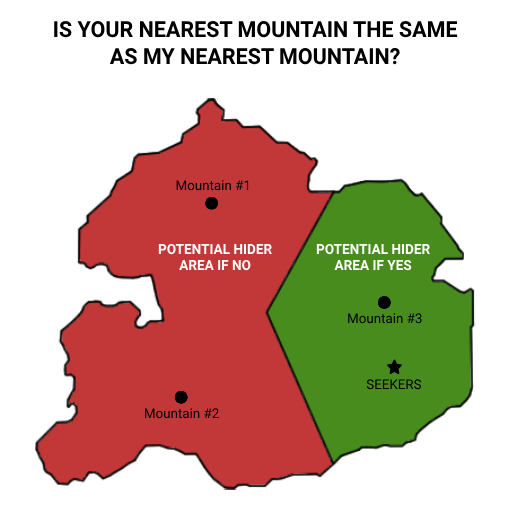

# Matching Questions

Matching Questions follow the format, "Is your nearest \_\_\_\_ the same as my \_\_\_\_" Valid answers are **yes** or **no**. Hiders have five minutes to answer. These questions can be useful at any point in the game, though they often require the seekers to move in order to optimize their efficacy. **It is important to note that if locations are not within a map's boundaries, players must operate as if they do not exist**. For example, if the seekers asked if they shared the same nearest commercial airport as the hider, but the only commercial airports were outside the map's boundaries, it would return a null answer (null answers count as answered questions, and hiders get to draw cards).

After a matching question has been answered, the hider may **draw 3 cards and keep 1**.

Here's a little diagram to help illistrate how matching questions can work:

These are the matching questions available to the seekers:

### Transit

#### Commercial Airport

If there is any ambiguity, an airport is considered commercial if you can view flights to/from it via Google Flights ([flights.google.com](https://flights.google.com))

#### Transit Line

_Important: In order to ask this question, seekers must be on the form of transit, and it must be moving._

The answer is yes if the transit the seekers are currently riding would stop at the hider's station. For clarity, best practice is for seekers to screenshot all the stations their transit would stop at and send them to the hider.

If the seekers are on a limited-stop/express train that passes through the hider's station but does not stop at it, the hider should answer "no". A "yes" answer is only given when the seekers' train would _stop_ at the hider's station.

#### Station Name's Length

Number of characters (hyphens and spaces count) in the station, as defined by your mapping app, if the app includes the word "station," that counts.

#### Street or Path

A street or path is considered to have ended when it aquires a different name. This includes changing from, say, "Jet Lag St. East" to "Jet Lag St. West"

If a street or path is unnamed, it is considered to start or end wherever it has an intersection.

### Administrative Divisions

#### 1st Administrative Division

This is the biggest formal category of division. For the US, it would be states. In Switzerland, cantons, in Japan, prefectures.

#### 2nd Administrative Division

A more detailed level of division. In the US, this is counties. In Switzerland, districts. In Japan, subprefectures.

#### 3rd Administrative Division

One more level down. In the US, Switzerland, and Japan, this would be municipality. Municipality borders can be occasionally difficult to define, so it's up to the seekers to clarify ambiguity.

#### 4th Administrative Division

Some places have no fourth administrative division, but many larger cities do. For example, New York City has boroughs, Zurich has districts, Tokyo has special wards.

### Natural

#### Mountain

Anything correctly classified as a mountain by your mapping app. Measure distance from the map icon.

#### Landmass

An area of land that is in one piece, not broken up by a waterway. If the hider is on a landmass that is entirely surrounded by the landmass the seekers are on, it counts as a match.

We urge players to be reasonable about this. There's a lot of interesting geography discussion to be had about what's its own landmass and what isn't. Is Cape Cod its own landmass or part of a peninsula, merely cut off by an artificial waterway? Hard to say! If your geography has any weird edge cases, we encourage you to discuss them beforehand. In game, as always, it is up to the seekers to clarify any ambiguity when they are asking a question.

#### Park

Anything correctly classified as a park by your mapping app. Measure distance from the map icon.

There's a possibility that measuring to the map icon can lead to strange outcomes–for example, if you are in a very large park but far from the center, you may be several miles from that park's map icon. You might be closer to the icon of a smaller, nearby park. This could mean that you are forced to say that your nearest park is the small one even though you are literally in the bigger park. Nonetheless, measuring to the map icon is the best, most objective way we've found to handle these questions, so we encourge sticking to that system even when it produces these edge case outcomes.

### Places of Interest

#### Amusement Park

Anything correctly categorized as an amusement park by your mapping app. Measure distance from the map icon.

#### Zoo

Anything correctly categorized as a zoo by your mapping app. Measure distance from the map icon.

#### Aquarium

Anything correctly categorized as an aquarium by your mapping app. Measure distance from the map icon.

#### Golf Course

An outdoor golf course. Miniature golf does not count. Driving ranges do not count. Measure distance from the map icon.

_We urge seekers to clarify their understanding of what counts when sending this question._

#### Museum

Anything correctly categorized as a museum by your mapping app. Measure distance from the map icon.

#### Movie Theater

Anything correctly categorized as a movie theater by your mapping app. Measure distance from the map icon.

### Public Utilities

#### Hospital

Anything correctly categorized as a hospital by your mapping app. Measure distance from the map icon.

#### Library

Anything correctly categorized as a library by your mapping app. Measure distance from the map icon.

#### Foreign Consulate

Anything correctly categorized as a foreign consulate by your mapping app. Exclude honorary consulates. Measure distance from the map icon.
